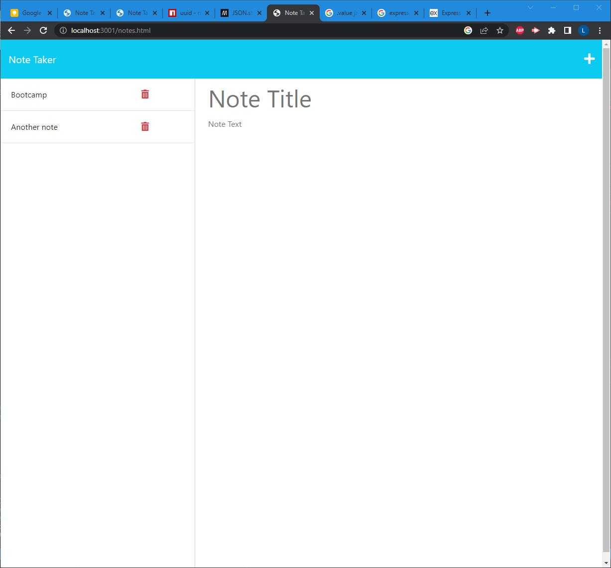

# Note-taker

## Description

People from all professions have various commitments and tasks to attend to throughout the week. It is easy to forget what you were set out to do. Having a note-taker that reminds you of your various commitments comes in handy. Through buidling this project, I learned setting routes for the server API, as well as fetching the data from client side. 

## Installation

No need to install any programs. Simply go to the deployed application and start using it!

## Usage

Find the deployed application at https://shielded-gorge-31073.herokuapp.com/notes.html

Click the link to the notes page to start using the app. Enter a title and notes in the right-hand side, and then press the save button found in the top right corner to save the note. You can find saved notes in the left hand side after refreshing the page. 

  

## License

This project is under the MIT license.

---
